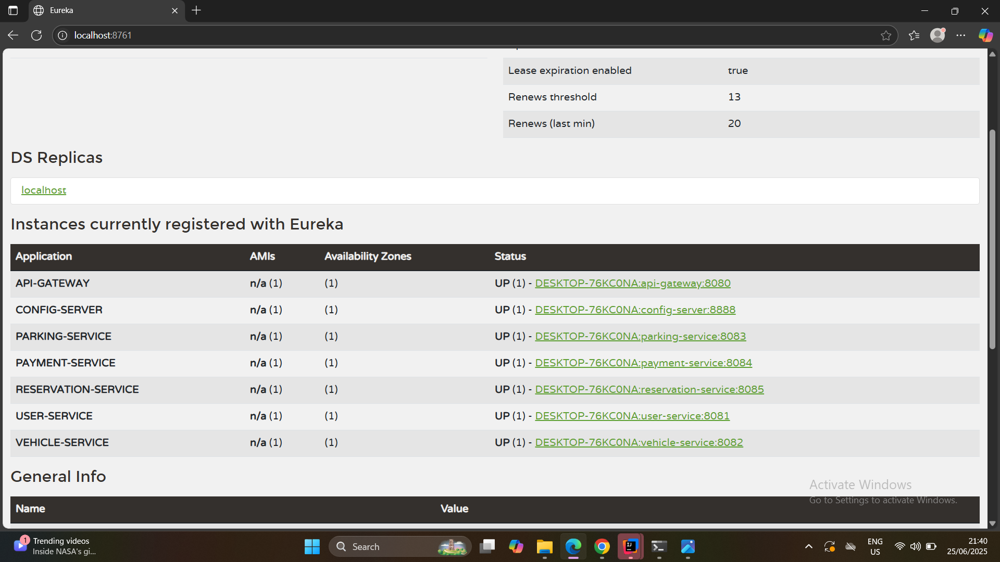

# 🚗 Smart Parking Management System (SPMS)

**Final examination project** for the **Graduate Diploma in Software Engineering**  
📘 *ITS 1018: Software Architectures & Design Patterns II*

---

## 📘 Project Overview

The **Smart Parking Management System (SPMS)** is a **cloud-native microservice-based application** built using **Spring Boot**. It provides a smart, scalable solution for urban parking challenges by enabling users to **search**, **reserve**, **pay**, and **manage** parking spaces in real time.

---

## 🎯 Key Features

- 📍 Real-time parking space availability and reservation  
- 🚘 Vehicle registration, tracking, and exit simulation  
- 👤 User and owner registration with **role-based access**  
- 💳 Simulated digital payments with receipt generation  
- 📡 Microservices service discovery via **Spring Cloud Eureka**  
- ⚙️ Centralized configuration using **Spring Cloud Config**  
- 🚪 Single-entry point through **Spring Cloud Gateway**

---

## 🛠️ Technologies Used

| Technology                      | Purpose                                |
|--------------------------------|----------------------------------------|
| Java 17                        | Programming language                   |
| Spring Boot                    | Core backend framework                 |
| Spring Cloud (Eureka, Config, Gateway) | Microservice orchestration     |
| Spring Data JPA + MySQL        | Database & ORM                         |
| Maven                          | Build and dependency management        |
| Postman                        | API testing tool                       |

---

## 📄 Resources

- 🧪 [Postman Collection](./smart_parking_management_system.postman_collection.json)
- 🖼️ 

---

## 🧩 Microservices Architecture

| Microservice        | Description                                      |
|---------------------|--------------------------------------------------|
| 🧾 **Config Server** | Centralized external configuration management    |
| 📘 **Eureka Server** | Service discovery and registration center        |
| 🚪 **API Gateway**   | Routes and filters external client requests      |
| 👥 **User Service**  | Manages user and owner registration/auth         |
| 🚗 **Vehicle Service** | Manages vehicle details, entry, and exit      |
| 🅿️ **Parking Service** | Handles parking space availability/reservation |
| 💰 **Payment Service** | Simulates payment and generates receipts       |

---

## 📈 Functional Highlights

- 🔍 Search and reserve parking spaces by location
- 💸 Make digital payments and receive receipts
- ⌛ Simulate vehicle entry and exit
- 🧾 View transaction and booking history
- 📊 Get usage analytics per city, zone, or space owner

---

## ✅ How to Run

Start services in the following order:

1. 📘 `eureka-server`
2. 🧾 `config-server`   
3. 🚪 `api-gateway`

Then start the business microservices:

- 👥 `user-service`
- 🚗 `vehicle-service`
- 🅿️ `parking-service`
- 💰 `payment-service`

### API Testing:

1. Import the Postman collection:  
   `smart_parking_management_system.postman_collection.json`

2. Test API operations like:
   - `POST /api/v1/users/register`
   - `POST /api/v1/users/login`
   - `POST /api/v1/vehicles/add`
   - `GET /api/v1/parking/available`
   - `POST /api/v1/payments/create`

---

---

## 📜 License

This project is licensed for educational purposes under the [MIT License](LICENSE).

---

## 🙌 Contributors

| Name            | Role                   |
|-----------------|------------------------|
| Danitha Dinuwan | Developer              |

---

## 🔚 Footer

> Developed as part of the final exam project for **ITS 1018: Software Architectures & Design Patterns II**  
> University / Institute: *IJSE - Graduate Diploma in Software Engineering*  
> 💡 *Empowering Smart Cities through Scalable Software Solutions*  
> 📆 Year: 2025  
> 📫 Contact: [danithahk@gmail.com](mailto:danithahk@gmail.com)

---

